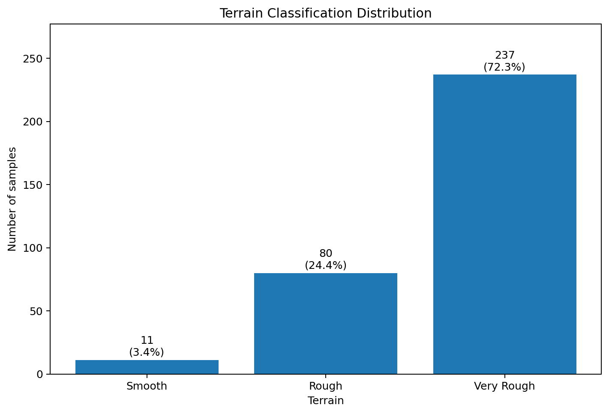
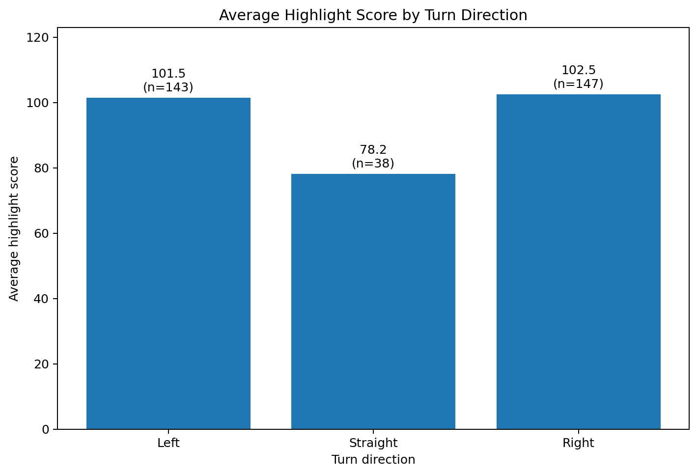
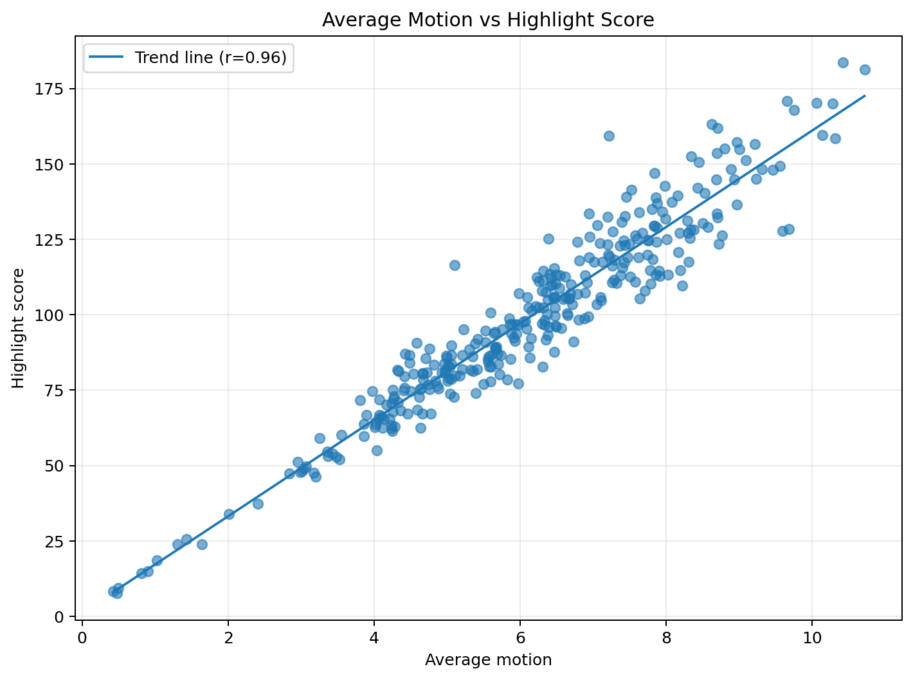
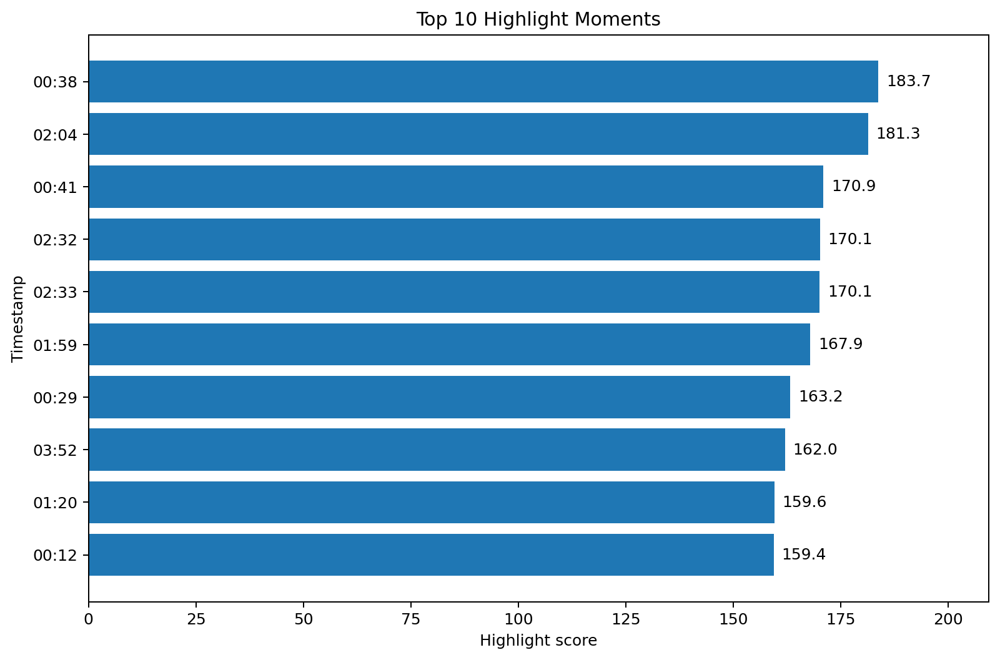

# TrailVision


TrailVision is a computer vision and video analytics platform that transforms GoPro mountain bike footage into ride metrics, highlight moments, extracted frames, and dashboard-ready analytics. The project demonstrates an end-to-end data pipeline using OpenCV, DuckDB, and modern analytics tools to automate ride analysis and generate visual insights.

## Problem

Manual review of mountain bike video is slow. A short ride can create thousands of frames, making it hard to find the best moments.

## Solution

TrailVision automates ride analysis using Python, FFmpeg, OpenCV, DuckDB, and planned dbt/Power BI reporting.






## Pipeline

```text
Raw GoPro Video
      ↓
FFmpeg Conversion
      ↓
OpenCV Analysis
      ↓
Motion + Optical Flow Metrics
      ↓
Highlight Extraction
      ↓
DuckDB
      ↓
dbt
      ↓
Power BI
```

## Tech Stack


- Python
- OpenCV
- FFmpeg
- DuckDB
- dbt (planned)
- Power BI (planned)
- Tkinter (planned)

## Current Features

- Convert GoPro video to analysis-ready MP4
- Read video metadata
- Calculate motion metrics
- Run optical flow analysis
- Extract highlight frames
- Store project data in DuckDB
- Use object-oriented models for rides and videos

## Installation

```bash
git clone https://github.com/maricia/TrailVision.git
cd TrailVision

python -m venv .venv
.venv\Scripts\activate

pip install -r requirements.txt
python app/main.py
```

## Project Structure

```text
MTB_Video_Analytics
├── app
├── charts
├── converted
├── database
├── docs
├── frames
├── models
├── output
├── raw_videos
├── scripts
├── services
├── tests
└── vision
```


## Architecture

The project is structured with a desktop app layer, a services layer, vision and model layers, and a data layer.

### System architecture diagram

```text
                         Project TrailVision
┌──────────────────────────────────────────────────────────────┐
│                         Desktop App                          │
│                    app/main.py - future GUI                  │
└───────────────────────────────┬──────────────────────────────┘
                                │
                                ▼
┌──────────────────────────────────────────────────────────────┐
│                         Services Layer                       │
│                                                              │
│   VideoService        AnalysisService        DatabaseService │
│   - metadata          - motion metrics       - rides         │
│   - conversion        - optical flow         - videos        │
│   - file paths        - highlights           - metrics       │
└───────────────┬──────────────────────┬───────────────────────┘
                │                      │
                ▼                      ▼
┌──────────────────────────┐   ┌───────────────────────────────┐
│       Vision Layer       │   │          Models Layer         │
│                          │   │                               │
│   motion.py              │   │   Ride                        │
│   optical_flow.py        │   │   Video                       │
│   highlights.py          │   │   Future: Metric, Highlight   │
└───────────────┬──────────┘   └───────────────────────────────┘
                │
                ▼
┌──────────────────────────────────────────────────────────────┐
│                        Data Layer                            │
│                                                              │
│   DuckDB                                                     │
│   database/trailvision.duckdb                                │
└──────────────────────────────────────────────────────────────┘
                                │
                                ▼
┌──────────────────────────────────────────────────────────────┐
│                    Analytics / Reporting                     │
│                                                              │
│   dbt models - planned                                       │
│   Power BI dashboard - planned                               │
└──────────────────────────────────────────────────────────────┘
```
# Roadmap

✔ Ride Database

✔ Video Import

✔ Optical Flow

✔ Analysis Engine

⬜ Trail Detection

⬜ Jump Detection

⬜ AI Highlights

⬜ GPS Overlay

⬜ Strava Import

⬜ Auto Reel Generator

# Installation

git clone https://github.com/maricia/TrailVision.git

cd TrailVision

python -m venv .venv

pip install -r requirements.txt

python app/main.py
